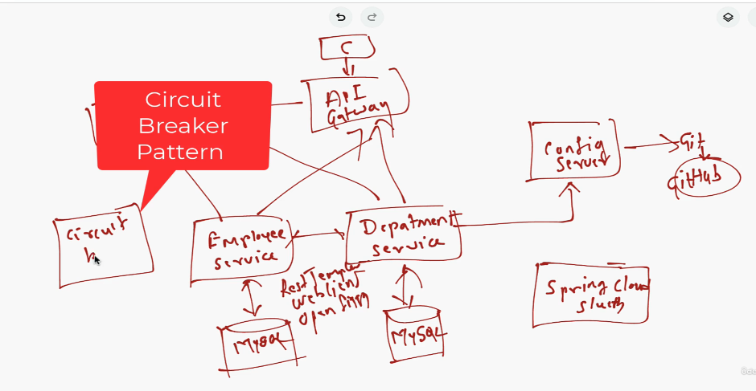

# MicroRough
# Section-15 Microservice Introduction
# 1-106) What are microservices really all about?
- Well, microservice architecture enables a large team to build scalable applications that composed of many loosely coupled services.
### Microservice architecture looks like

- For example, consider this is a microservice architecture for a simple shopping cart application.
    - It has different services like product service, inventory service, stock service and these are the independent and loosely coupled services in microservices project.
- Each microservice have their own database.
    - For example product service has their own database and so-on-so-forth.
- so loosely coupled meaning
    - all the services in a microservices project are independent to each other, 
    - and each microservice should be developed independently.
    - Each microservice should be deployed independently, and each microservice should be scaled independently.
- Services can communicate with each other.
    - For example, product service can communicate with inventory service and inventory service can communicate with stock service and so-on-so-forth.
- There are two types of communication styles.
    - synchronous communication styles and another is asynchronous communication styles.
- In case of synchronous style communication, we can use Http protocol to make a Http request from one microservice to another microservice, 
- and in case of Asynchronous style communication, we have to use a message broker for communication between multiple micro services.
    - For example, we can use RabbitMQ or Apache Kafka as a message broker in order to make asynchronous communication between multiple microservices
-  each microservice in a microservices project can  expose a Rest APIs.
    - For example, product service can expose to Rest APIs, inventory service can expose the Rest APIs, and stock service can expose the Rest APIs.
- And here product service can communicate with inventory service. It means product service have to call the Rest API of inventory service using Http protocol.
## Key Componenets in Microservice architecture
### API Gateway -
- Well, whenever client sends a request to API gateway and then API gateway will route that the request  to the relevant microservices.
- the client can be a web application a mobile application or a desktop application.
- And whenever client want to consume the Rest APIs back end services, the client have to first send  a request to API gateway.And then API gateway will route that request to the relevant microservice.
### Service Registry -
- Well, all the microservices in our microservice project will register to service registry, and the  API gateway will discover the particular microservice hostname and port using service registry
### Config Server -
- So this config server component will basically externalize the configurations of microservices
### Distributed Tracing -
- in order to maintain the logs or complete log hierarchy of a particular Http call, we can use  distributed tracing.
## Summary

# 2-107) Is Microservie a framework?

# 3-108) Monolith Architecture and challenges of monolith architecture

## Monolith

- For example, consider our monolithic application that is employee management system application and team one is working on these two functionalities or features and Team two is working on these two functionalities and Team three is working on these functionalities.
- It means different teams are working on different parts of the monolithic application and they need to coordinate to make sure that they don't affect each other's work because all the functionalities are features are tightly coupled in a monolithic application, isn't it?
- For example, if you change the single line of code in a employee management feature, then you have to package this complete monolithic application as a one WAR file and you need to redeploy in the application server.
- So this was the standard way to develop the monolithic applications.
### Challenges

### 1. Infra cost
- Consider again, our employee management system monolith application.And if we want to scale only the employeee management feature or service, then we have to scale the entire, you know, employeeer management system monolith application.
- We cannot scale only this feature or this service. So this will lead higher infrastructure costs because unnecessarily we are also scaling other features or services of this monolith application.
### 2. dependency variance
- For example, consider again our employeee management monolith application and let's say employeee management department management so both the features or services are want to consume the third party library APIs.
- And let's say department management want to use the third party library version 1.5 and if you employee management want to use the third party library was in 1.6, then it is not possible in a monolith application because in a monolith application we can add only one dependency with its version.
- We cannot add two dependencies with two different versions.
# 4-109) What is microservice and how it solves the challenges of monolith architecture?

##  how we can decompose or break down the existing monolith application into microservices.

- So if we want to convert this monolith application into microservices, then we will convert each feature or module of this monolith application into a separate service in a microservices project.
- And each services in microservices project have their own databases.
- each microservice  should be independent to each other 
- each microservice should be developed separately and each microservice should be deployed separately and each microservice should be scaled separately.
### Challenge resolve

- Next, as monolith application becomes larger and complex, its codebase also becomes too large and complex. But in case a microservices project, each service have their own codebase so we can maintain a smaller codebase for each and every services.
# 5-110) Microservices architecture benefits and best practice
## whenever we create a microservice architecture. We will encounter these important questions like

## 2 types of communication

- For example, consider here we have the employee service and department service
- and employee service Wants to communicate with department service.
- Then employee service have to send a request or message to the message broker 
- and the department service will subscribe to that message broker and it will get the message from the message broker.
- So this is how the asynchronous communication works. 
### Remember
-  Whenever employee service sends a request to department  service through message broker then employee service don't have to wait a response from the department service and the service can continue its task.
# 6-111) Understanding Spring Cloud and it's important modules

- In our project, we have multiple microservices. Consider Microservice 1, microservice 2, Microservice 3, so on and so forth.
- And here we have a client and this client will consume the rest APIs from multiple microservices.
- Well, consider microservice 1  exposes some of the rest APIs and so on and so forth.
- and this client will consume the rest APIs from multiple micro services.
## Challenges
- Well, in the enterprise application, we may have 100 or 1000's of microservices and we may encounter a lot of challenges while building these microservices.
### Problem-1
-  here basically this client is calling the multiple backend microservices to get the response from different REST APIs
- And whenever this client call a multiple microservices, then this client have to remember the host and port of all the microservices that it wants to communicate.
- And let's say whenever we introduce a new microservice in this project, then we have to configure that microservice hostname and port in this client so that client can call that particular microservice
- It's not a good practice.
### Solution - API Gateway

- We can introduce one central component between client and back microservices 
- and client will send a  request to this central component, and this central component will route that request to appropriate microservice.
- And we can call this central component as the API gateway
- So API Gateway is basically a pattern that we can use to handle the client request and route that client request to appropriate microservice
### Problem-2
- we may have a lot of microservices, And each microservice have their own configuration file to maintain its configuration
- And let's say we have a requirement to change the configuration file of multiple microservices.
- Then we have to go into each and every microservice and then we need to change the configuration.
-  So this is not a good idea 
### Solution

- we can have a central place where we can keep all the configuration files of all these microservices.
- And whenever there's a requirement to change the configuration of multiple microservices, then we can simply go ahead and change in a central place over here.
- For example, let's say we use a Git repository to keep all the microservices configuration files,
    - and whenever there is a requirement to change the configuration files of all these microservices, then
    - we can go ahead and simply change in a Git repository and that change will reflect in all the microservices
- to externalize the configuration files of these microservices, we can implement one more pattern let's call it config server.
### Problem-3
- Consider client wants to consume the REST APIs of Microservice 1 
- then client have to first send a request to API gateway and then API gateway will route that request to Microservice 1 
- and consider Microservice 1 internally calling Microservice 2
- and consider due to some reason Microservice 2 is down.
- Then Microservice 1 won't get a response from the Microservice 2 and Microservice 1 will return the error response to the API Gateway and then API Gateway will forwarded that error response back to the client.
- So if you can notice here, if Microservice two is down, then Microservice one will continuously call to the Microservice two.
#### So this is not a good idea
- Microservice two is down and Microservice one have to continuously call to the Microservice two. So this is basically wasting of our resources.
### Solution - Circuit breaker pattern

- So there should be a mechanism where this Microservice one have to limit the number of calls to the Microservice two whenever this Microservice two is down or not available.
- So this challenge we can implement by using circuit breaker pattern.
### Problem-4
- Consider in this microservices project, we have three microservices Microservice one, Microservice two and Microservice three.
- And let's say we have a requirement to scale Microservice one project, then we'll start multiple instances,
- Let's say instance 1, instance 2 and due to some reason, instance 2 is down and microservice 2 is down.
- And we need a mechanism where we can keep track of all these microservices and its instances so that we can see what are the microservices are up and what are the microservices are down
### Solution - Service Registry and discovery

- so in order to solve this issue, you can use a service registry and discovery.
- So this service registry basically maintains the hostnames and ports of all the registered microservices and it's instances.
- And this API gateway will basically get to the hostname and port of a particular microservice from the service registry.
- So this API gateway will basically discover the particular microservice hostname and port from the service registry.
### Problem-5
- Let's say a client make a HTTP REST API call to API Gateway and then API Gateway will route that request to microservice one and microservice one will internally call to microservice two.
- So this is a complete a call hierarchy,
- And we need a log information of this complete, you know, call from start to end.
### Solution - Distributed Tracing

- So this we can implement using distributed tracing, distributed tracing.
- So this distributed tracing pattern will help us to identify the complete call hierarchy from start to end.
### Future Problem
- Next, few more challenges like implementing load balancing and implementing centralized security in API gateway. So these are the challenges that we encountered whenever we develop the microservices project.
### Adding another new microservice project
- Next, let's say we want to develop one more microservices project.
- Then we'll basically use all these patterns like API Gateway, service registry, config server,distributed tracing, circuit breaker.
- So basically we use this pattern in this microservice project as well.
- It means that these are the basically common patterns or common design patterns that we typically use ineach and every microservice or project to address some of the issues or challenges
### Sprin Cloud Role

- And in order to implement these patterns we discussed, we have to write a code manually.
- So if we use the spring cloud, then we don't have to write the code manually because Spring cloud provides implementation for all these patterns.
- So Spring Cloud basically provides the tools to implement these commonly used patterns in a microservices project.
# 7- 112) Microservice architecture with Spring boot and Spring cloud

- Well, we are going to create three core backend microservices employee service, department service and organization service, and all these three microservices have their own databases.
- Once we build the microservices next, we'll see how these microservices communicate with each other.
    - Well, we are going to use different ways to make a REST API call from one microservice to another Microservice
    -  For example, we will use a rest template, we will use web client and we will use Spring cloud provided open feign library.
### For communication

- next we are going see how to implement service Registry and discovery pattern in our microservices project.
- Well, Spring Cloud provides Spring Cloud Netflix Eureka Based Service Registry module that we can use to implement service registry and discovery pattern in our microservices project.
- Well, service Registry and discovery is really essential pattern that we can use to avoid hard coding hostnames and ports.
- Next, we will implement config server to externalize the configurations of all these three microservices into a central place that is git repository.
- Next, we have to implement API gateway. 
- Well, API Gateway plays a very important role in our microservices architecture.
- So whenever a client want to make a call to different microservices, then client have to remember the host names and ports of all these microservices.
- So there should be a solution where a client can send a request to the central component so that is where the API gateway comes into picture.
- So whenever a client sends a request to the backend microservices, then client have to send a request to the API gateway first and then the API gateway based on the routing rules, it will route that request to appropriate microservice.
- Well, Spring Cloud provides Spring Cloud Gateway module to implement API gateway pattern in a microservices architecture.
-  next we are going to implement a distributed tracing in our microservices architecture.
- Well, Spring Cloud provides Spring Cloud sleuth module, which we can use to implement a distributed tracing in our microservices project.
- Well, along with Spring Cloud Sleuth, we'll also use Zipkin to visualize the tracing log information in a user interface.
- Well, Zipkin provides a user interface to track the trace information through web application.
- next we are going to create a simple React application which will make a call to backend microservices
### Circuit breaker pattern

- we are going to implement circuit breaker pattern in a employee service because the employee service is internally calling department service and let's say due to some reason, department service is down.
- Then employee service won't get a response from the department server, isn't it?
- And then again, employee service will send internal server error to the API gateway and then API Gateway will send that response back to the client.
- So in order to avoid this kind of issue, we can use a circuit breaker pattern.
- So this circuit breaker pattern helps the employee service to avoid a continuous calls to the department service Whenever department service is down and this circuit breaker pattern will help employee service to return some default response back to the API Gateway and the API Gateway will send that default response to the client.
# 8-113) Let's draw dig of microservices architecuture for our project

- Well, we'll start building two microservices. First microservices employee Service. Second microservice is Department Service.
- So these microservices should be have their own databases. We gonna use MySQL database.
- Well, we'll create these to microservices as a Spring Boot project and we'll connect these to projects with respect to MySQL databases.
## Communication between microservices

-  next, we'll see how these two microservices will communicate with each other using different approaches.
- So we'll see how employee service will communicate with department servers using rest template
- and we'll see how to use a web client to make a REST API call from employee service to department service
- and we will also see how to use open feign library from Spring Cloud to make a REST API call from employee service to department service.
## Service Registry

- Next, we'll create a service registry using Spring cloud Netflix Eureka server and then we'll register these two microservices as a Eureka client with this Eureka server.
## API Gateway

- Next, we are going to create a API gateway.
- So Spring Cloud provides Spring Cloud Gateway module which we can use to implement API gateway pattern in our microservices project.
- And then we'll configure the destination URL's of Employee service and department service in our API gateway so that API gateway can able to route the request to these two microservices.
## Client

- And here we have a client.
- Well, here client first sends the request to the API gateway and then API Gateway will route that request to the appropriate micro service.
- Well, you might be wondering how API gateway will know the hostname and port of these two microservices.
    - Well, whenever we create a service registry and we register these two microservices as a client with this service registry based Eureka server, then this service registry will hold the hostname and port of these two microservices.
    - And whenever a client sends a request to API Gateway, then API Gateway will get the host name and Port of respect to microservice from the service registry and then it will route that request to appropriate microservice.
    - So this is how API Gateway will use service registry to get the hostname and port of respect to microservice.
## Config Server

-  next we are going to implement one more pattern that is config server.
- Well, spring Cloud provides Spring Cloud config server module to implement config server.
- So this config server will basically externalize the configurations of these micro services.
- So basically we need to centralize the configurations of these two micro services in a central place and we are going to use Git as a storage to store the configuration files.
- So basically we are going to create Git repository on GitHub
## More info

- Next, these employee service and department service needs to fetch the configuration from config server.
- For that, we need to register this employee service department service as a config client to the config server.
## Distributed Tracing

- we want to see how to implement a distributed tracing using Spring cloud sleuth module.
- Well, here will introduce one more component that is Spring Cloud sleuth library.
- So this library module will help us to implement a distributed tracing in our microservices project.
## Flow trace
- Well, whenever clients make a REST API call to the employee service, the request first come to the API gateway
- and then API Gateway will route that request to the employee service,
-  and then employee service will internally call a department service to get the department details 
- and then employee service will send a response back to the API gateway 
- and then API Gateway will forward that response to the client. So this is how the flow goes.
- And in order to trace the log information of this complete call, we are going to implement a distributed Tracing using Spring cloud sleuth module.
## Circuit Breaker pattern

- Next, we want to implement one more component that is circuit breaker Patten
- So basically we are going to use Resilience4j framework to implement circuit breaker pattern,
- Well, we are going to implement circuit breaker pattern
    - in a employee service because the employee service is internally calling department service 
    - and let's say due to some reason department service is down then employee service won't get a response from the department service, isn't it?
    - And then again, employee service will send internal server error to the API gateway and then API Gateway will send that response back to the client.
- So in order to avoid this kind of issue, we can use circuit breaker pattern. 
## Adding new microservices

- we are going to introduce one more microservice.
- Well, basically we will see how to add a new microservice step by step to the existing project.
- So we are going to basically create one more microservice that is organization service.
## React App

- we are going to create a simple React application as a client to make a REST API call to API gateway
# 9-114) Microservices application and it's port mapping.

# 10-115)

## GitHub repository for Spring Boot 2.7.4 
- https://github.com/RameshMF/springboot-microservices/tree/main/springboot-microservices
## GitHub repository for Spring Boot 3
- https://github.com/RameshMF/springboot-microservices/tree/main/v3/springboot-microservices
# Section-16 FAQs
# 1-116) Spring boot vs Spring Cloud

## Definition
- In simple terms, Spring Boot helps you build a single app. Spring cloud helps you manage a group of apps working together.
- Think of Spring Boot as your first step into modern Java development, and Spring Cloud as the next step once you're scaling your app across services.
- To wrap it all up, Spring Boot helps you create Java apps quickly with minimal setup.
    - It focuses on simplicity, speed, and standalone apps.
- Spring cloud builds on top of that, helping you manage your large systems made up of many spring Boot apps.
    - It's built for resilience, scalability, and the cloud.
# 2-118) Spring Boot vs Microservices

## Definition
- So Spring Boot is a framework you code with. Think of it like a toolkit that helps you write Java APIs with less boilerplate code.
- Microservices are a design principle you architect around. Microservices, on the other hand, are an architectural style.
    - They describe the way you structure your application.
    - Breaking it down into small, independently deployable services.
# Helo1

